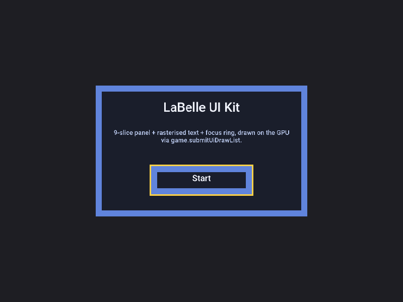

# On-GPU UI-kit DrawList demo (#787, deliverable 1)

The real-GPU render proof for the in-game UI kit: a runnable sokol-desktop
game that builds a labelle-gui `ui_kit.Tree`, walks it into a `DrawList`, and
submits it to the engine via **`game.submitUiDrawList`** — so the engine's
#771 UI-kit consumer composites it on the actual GPU.



The capture above shows all four DrawList command kinds rendered on the GPU
(offscreen Metal), not a mock recording sink:

- **`textured_quad` (9-slice)** — the panel border/interior, resolved from a
  procedural theme atlas through `game.resolveUiFrame`.
- **`text_line`** — the "LaBelle UI Kit" title + the wrapped body line, real
  Roboto glyphs baked by `game.bakeUiFont` (stb_truetype behind the engine's
  `FontBackend` seam) and resolved through the kit's `FontResolver`.
- **`solid_quad` / `textured_quad`** — the "Start" button panel.
- **`focus_highlight`** — the yellow focus ring around the focused button.

This is the acceptance evidence the headless #771 integration test could not
produce (it drove `renderCommands` against a recording sink; here the exact
same engine code path drives the real gfx `GfxRenderer` on the sokol backend).

## Run it

```sh
# Windowed (needs a GUI session):
zig build run

# Surfaceless capture (no window / no GUI session — offscreen Metal):
LABELLE_HEADLESS=1 \
LABELLE_SCREENSHOT_PATH=/tmp/uikit.bmp \
LABELLE_SCREENSHOT_AFTER_SEC=0.3 \
  zig build run
```

## How the engine ⇄ kit binding works

`main.zig` wires the two resolver callbacks that are the whole cross-repo seam:

- `render.FrameResolver` → `game.resolveUiFrame(name)` (atlas UVs + texture id).
- `render.FontResolver` → `game.uiFont(name)` wrapped in a
  `ui_kit.font.FontMetrics` (the glyph/codepoint/kern tables are `extern`-
  identical between labelle-core and the kit, so the wrap is a `@ptrCast` of
  the slices + four scalar copies).

Each frame: `ui_kit.layout.apply` → `ui_kit.render.build` → the resulting
`DrawList.items` are handed to `game.submitUiDrawList(...)`; `game.render()`
draws them (via `renderSubmittedUi`, after the world pass) through the gfx
screen-space primitives (`drawScreenTexture` / `drawScreenRect`, gfx #311).

## Building notes (cross-repo, local-dev)

This is a **cross-repo local-dev example** — it is not built in CI, because it
depends on code that is not all released/merged yet:

- **labelle-engine** ≥ v2.7.0 (the #771 UI-kit consumer + `ui_kit_mixin`) —
  wired here as the `../..` path dep.
- **labelle-gfx** ≥ v1.28.2 **plus** the `createTextureFromPixels`
  Impl-land fix (labelle-gfx PR for #787). Without that fix the engine's font
  atlas upload does not compile against a real backend (see below).
- **labelle-gui** — the `ui_kit` module, currently on the ui-kit branch
  (labelle-gui#215); labelle-gui does not export it as a build module, so
  `build.zig` points a fresh module straight at its `mod.zig`.
- **labelle-sokol** — the sokol backend (gfx/input/audio/window + sokol_clib).

`build.zig.zon` assumes a flat sibling checkout under one parent directory.

### The gfx fix this demo surfaced

Standing up this demo revealed that gfx #311's `createTextureFromPixels`
routed its upload through the `Backend(Impl)` core-contract wrapper, whose
`uploadTexture` forwarder is typed against core's `DecodedImage`. A backend's
own `DecodedImage` is only *structurally* identical (backends carry no
labelle-core dep), so that path crossed the nominal-type boundary and failed
to compile on every real backend — which is why #771's font pipeline only ever
compiled against the mock renderer. The fix uploads straight through
`BackendImpl` (a backend-native handle, exactly like the render-target
methods), keeping it in Impl-land.

## What remains of #787

This example is deliverable **(1)** only. Still open:

- **(1b) Assembler `ui_kit`-as-game-dep wiring.** Games still cannot declare a
  `ui_kit` dependency through the assembler; this example wires it by hand.
  The minimal path is for the assembler to expose `ui_kit` as an available
  module (or the engine to re-export the kit's `Tree`/`render` surface) plus
  the two resolver callbacks.
- **(2) Editor FrameResolver preview** (labelle-gui) — wire the editor's
  `atlas.Index` as the DrawList `FrameResolver` so authored UI trees preview.
- **(3) Acceptance** — rebuild Flying-Platform's build menu on the kit with
  gamepad focus navigation, and swap a UI theme via an asset pack.
